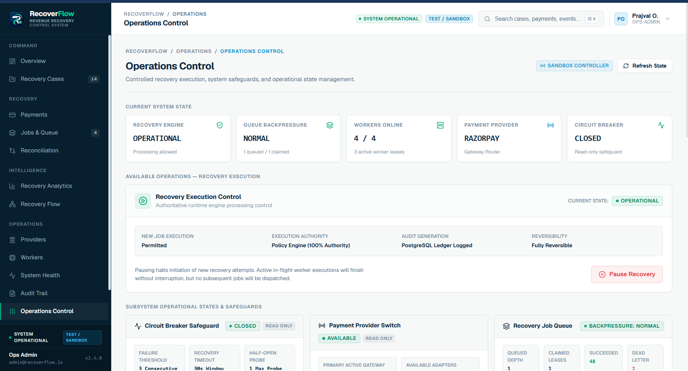

<div align="center">

# RecoverFlow

**Payment Recovery Operations Platform**

When a payment fails, revenue doesn't just disappear — it enters a recoverable window.
RecoverFlow gives engineering and payments teams the visibility, automation, and safety controls to recover that revenue before it's lost.

[](https://nextjs.org/)
[](https://fastapi.tiangolo.com/)
[](https://www.postgresql.org/)
[](https://www.typescriptlang.org/)
[](https://www.python.org/)
[](./backend/tests/)
[](#license)

[**Live Demo**](https://recoverflow.vercel.app) · [**Repository**](https://github.com/your-username/recoverflow) · [**Architecture**](#architecture)

</div>

---

## Product Preview

> The deployed interface currently runs in Test/Sandbox mode. Sandbox records and baseline metrics are clearly labelled and are not presented as genuine production payment data.

RecoverFlow provides a unified operational view of payment recovery, failed transactions, recovery workflows, analytics, and execution safeguards.

### Operations Command Center


The main dashboard provides visibility into total recovery cases, active recoveries, revenue at risk, recovered revenue, recovery rate, and verified recovery attempts. The interface displays live system telemetry and operational status in **Test / Sandbox mode**.

### Recovery Case Management


The Recovery Cases view helps operators investigate failed payments, monitor case status, review retry attempts, and identify cases requiring manual review within the **Sandbox Repository**.

### Payment Monitoring


The Payments view connects payment transactions with provider information (e.g. Razorpay sandbox), failure codes, customer details, and linked recovery cases.

### Recovery Orchestration Flow


The Recovery Flow view shows the complete recovery lifecycle, including signal detection, classification, AI advisory, deterministic policy execution, provider execution, reconciliation, and audit logging. Crucially, the **AI Advisory holds 0% execution authority**, while the **Deterministic Policy Engine holds 100% execution authority** to enforce idempotency and retry budgets safely.

### Recovery Analytics


The Recovery Analytics view presents recovery attempts, recovered cases, recovery rate, recovered revenue, and performance across multiple evaluation windows (7D, 30D, 90D) evaluated against the **Sandbox Baseline**.

### Operations Control



The Operations Control view exposes execution safeguards, queue backpressure health, worker availability, provider status, circuit-breaker state, and recovery execution controls.

---

## Why RecoverFlow?

Every payment platform deals with failed transactions. A card times out. A bank returns an insufficient-funds error. A gateway goes down for 30 seconds.

These failures aren't necessarily permanent. Many failed payments are recoverable if the retry happens at the right time, with the right strategy, and with proper safeguards.

The problem is that most recovery workflows are either:

- **Manual** — someone checks a spreadsheet, decides whether to retry, and hopes it works
- **Blind** — a cron job retries everything with the same delay, with no visibility into outcomes
- **Unsafe** — retry logic lives in application code with no audit trail, no retry limits, and no circuit breakers

RecoverFlow addresses this by treating payment recovery as a first-class operational domain with explicit state management, deterministic policy governance, traceable execution, and clear separation between advisory intelligence and financial action.

---

## Key Features

### Recovery Case Management
Each failed payment creates a **Recovery Case** with an explicit state machine (`DETECTED → ANALYZING → RECOMMENDATION_READY → POLICY_REVIEW → APPROVED → EXECUTING → RECOVERED`). Cases track priority, attempt count, risk amount, and terminal states.

### Deterministic Policy Engine
A rule-based policy engine evaluates every recovery action before execution. It enforces:
- Maximum retry attempt limits
- Cooldown periods between retries
- Monetary risk thresholds for automated execution
- Terminal state protection (no action on already-recovered or stopped cases)

### Advisory AI Agent (Recommend-Only)
An AI agent observes the case context, diagnoses failure causes, generates candidate recovery actions, and produces a structured recommendation with confidence scores. **The agent has zero direct execution authority** — every recommendation must pass through the policy engine.

### Recovery Execution & Orchestration
The `RecoveryOrchestrator` accepts only approved `PolicyDecision` objects. It rejects direct `AgentDecision` inputs at the code level. Execution generates deterministic idempotency keys, preventing duplicate recovery attempts.

### Razorpay Provider Integration
A production-grade Razorpay API client supports authenticated communication, request timeouts, idempotency headers, and response normalization. A simulated provider is available for testing without hitting real APIs.

### Circuit Breaker
A thread-safe circuit breaker state machine (`CLOSED → OPEN → HALF_OPEN → CLOSED`) protects the system from cascading failures when a payment provider becomes unhealthy.

### Job Queue & Workers
Recovery jobs use a database-backed queue with skip-locked claims, lease-based ownership, priority scheduling, backpressure control, deduplication, and dead-letter handling. Workers register with heartbeats and support failover.

### Reconciliation
After execution, a reconciliation service maps provider results back to domain outcomes, handling success, failure, timeout, and ambiguous states separately.

### Audit Trail
Every significant action — case detection, agent analysis, policy evaluation, execution dispatch, outcome recording, escalation — is recorded as a typed audit event with correlation IDs for end-to-end traceability.

### Security
- Operations API authentication with constant-time key comparison (`hmac.compare_digest`)
- Role-based access control (VIEWER, OPERATOR, ADMIN)
- Webhook replay protection with bounded in-memory store
- Rate limiting per endpoint category
- Request security middleware
- Server-side API proxying — no backend URLs or keys are exposed to the browser

### Sandbox & Data Safety
The system supports four explicit data modes:
- `SANDBOX_BASELINE` — approved demo metrics without claiming live data
- `SANDBOX_SEED` — curated records in the database, clearly tagged
- `LIVE_DATABASE` — genuine production records with calculated metrics
- `EMPTY_DATABASE` — honest zero-state when the database has no records

Seeded sandbox records are marked with `data_source="SANDBOX_SEED"` and can never be confused with real payment data.

---

## Architecture

```
┌─────────────────────────────────────────────────────┐
│                   Browser (Client)                  │
│                                                     │
│   Next.js React App (TypeScript, CSS Modules)       │
│   Dashboard · Cases · Payments · Jobs · Analytics   │
│   Audit · Reconciliation · Workers · Providers      │
└───────────────────┬─────────────────────────────────┘
                    │  Client-side fetch to /api/*
                    ▼
┌─────────────────────────────────────────────────────┐
│            Next.js Server (Route Handlers)           │
│                                                     │
│   Server-side proxy layer                           │
│   - Injects X-Operations-Key (server-only)          │
│   - Injects X-Operations-Role                       │
│   - Transforms backend responses for UI             │
│   - No secrets exposed to browser                   │
└───────────────────┬─────────────────────────────────┘
                    │  Authenticated HTTP (server → backend)
                    ▼
┌─────────────────────────────────────────────────────┐
│              FastAPI Backend (Python)                │
│                                                     │
│   ┌─────────────┐  ┌──────────────┐  ┌───────────┐ │
│   │  Security    │  │ API Router   │  │ Events    │ │
│   │  Auth, Rate  │  │ /api/v1/*    │  │ Webhooks  │ │
│   │  Limit,      │  │ Operations   │  │ Processor │ │
│   │  Replay      │  │ Metrics      │  │ Normalizer│ │
│   └──────┬───────┘  └──────┬───────┘  └─────┬─────┘ │
│          │                 │                │       │
│   ┌──────▼─────────────────▼────────────────▼─────┐ │
│   │              Domain Layer                      │ │
│   │  RecoveryCase (State Machine)                  │ │
│   │  AI Agent (Advisory) → PolicyEngine (Decide)   │ │
│   │  Orchestrator (Execute) → Reconciliation       │ │
│   │  AuditTrail · Intelligence · Scoring           │ │
│   └──────────────────────┬─────────────────────────┘ │
│                          │                           │
│   ┌──────────────────────▼─────────────────────────┐ │
│   │         Execution & Infrastructure             │ │
│   │  Provider Registry · Circuit Breaker           │ │
│   │  Razorpay Client · Simulated Provider          │ │
│   │  Job Queue · Priority Scheduler                │ │
│   │  Worker Registry · Backpressure Control        │ │
│   └──────────────────────┬─────────────────────────┘ │
│                          │                           │
└──────────────────────────┼───────────────────────────┘
                           │
                    ┌──────▼──────┐
                    │ PostgreSQL  │
                    │ 14 tables   │
                    │ SQLite dev  │
                    └─────────────┘
```

### Key Architectural Decisions

**AI recommends, Policy decides, Orchestrator executes.** The AI agent produces a `AgentDecision` with a recommended action and confidence score. The `DeterministicPolicyEngine` evaluates that decision against safety rules. The `RecoveryOrchestrator` only accepts an approved `PolicyDecision` — passing a raw `AgentDecision` raises `PolicyApprovalRequiredError` at the code level.

**Server-side proxy for security.** The Next.js frontend never communicates directly with the backend from the browser. All API calls go through Next.js Route Handlers, which inject authentication headers server-side. No `NEXT_PUBLIC_` variables contain backend URLs or keys.

**Non-blocking startup.** Database table creation and sandbox seeding run in a background daemon thread. The FastAPI application binds to Render's `$PORT` immediately, preventing deployment timeouts.

---

## Engineering Highlights

### Why a Deterministic Policy Engine Instead of Letting AI Execute Directly?

In payment systems, an AI model suggesting "retry this payment" is useful. An AI model directly retrying a ₹1,00,000 transaction without safety checks is dangerous.

RecoverFlow enforces a hard boundary: the AI agent produces a recommendation, but the `DeterministicPolicyEngine` is the only gate that can approve execution. The policy engine checks retry limits, cooldown periods, monetary risk thresholds, and terminal states — all deterministically, with no probabilistic override.

This matters because:
- **Retry floods** can trigger fraud detection at the issuing bank
- **Duplicate charges** from missing idempotency create customer disputes
- **Uncontrolled high-value retries** expose the platform to financial risk

### Idempotency at Every Layer

Recovery executions generate deterministic idempotency keys (`rec_{case_id}_{action_type}_{attempt_count}`). Jobs use unique idempotency constraints. Payment events use composite uniqueness (`provider_event_id + provider`). Webhook processing records prevent duplicate event handling.

### Explicit State Machines

Both `RecoveryCase` and `RecoveryExecution` use validated state transitions. The `VALID_CASE_TRANSITIONS` dictionary defines every legal transition. Attempting an invalid transition raises `InvalidCaseStateTransitionError`. Terminal states (`RECOVERED`, `ESCALATED`, `STOPPED`) are immutable.

### Safe Data Separation

Sandbox-seeded records carry `data_source="SANDBOX_SEED"` at the database column level. The metrics service checks every record's `data_source` attribute before deciding whether to report `LIVE_DATABASE` or `SANDBOX_SEED` metrics. If even one genuine record exists, the system reports live data and never falls back to sandbox baseline values.

### Constant-Time Authentication

Operations API keys are compared using `hmac.compare_digest`, preventing timing attacks that could leak key information through response latency differences.

---

## Data Modes and Safety

| Mode | Database State | Metrics Response | Dashboard Label | Behavior |
|:---|:---|:---|:---|:---|
| `EMPTY_DATABASE` | No records | Honest zeros | **EMPTY DATABASE** | Shows `$0` and `0 cases` without pretending data exists |
| `SANDBOX_BASELINE` | Empty, seeding enabled | Approved demo values | **SANDBOX BASELINE** | Displays approved buildathon baseline (1,240 cases, $245,680 at risk) |
| `SANDBOX_SEED` | Only sandbox records | Approved demo values | **SANDBOX SEED** | Curated demo records in DB, clearly marked |
| `LIVE_DATABASE` | Genuine records present | Calculated from DB | **LIVE DATABASE** | Real metrics from actual payment data |

**Safety invariants:**
- Sandbox records are never presented as genuine payment data
- Genuine records always take priority over sandbox data
- The seeder only runs when `RECOVERFLOW_SEED_SANDBOX=true` and all core tables are empty
- Seeding is transaction-safe — it rolls back completely on any error
- Repeated seeder calls do not create duplicate records

---

## Technology Stack

| Layer | Technology | Purpose |
|:---|:---|:---|
| Frontend Framework | Next.js 16.3 (App Router) | Server-side rendering, API route handlers, static generation |
| Frontend Language | TypeScript 5.x | Type-safe component and service development |
| UI Styling | CSS Modules + CSS Custom Properties | Component-scoped styles with design token system |
| Typography | Geist, Geist Mono, JetBrains Mono | Interface and monospace fonts via `next/font/google` |
| Backend Framework | FastAPI | Async-capable Python API with automatic OpenAPI docs |
| Backend Language | Python 3.14 | Domain modeling, policy engine, orchestration |
| Database | PostgreSQL (production) / SQLite (development) | Persistent storage for all recovery domain entities |
| ORM | SQLAlchemy | Database models, relationships, migrations |
| Migrations | Alembic | Schema versioning and migration management |
| HTTP Client | `urllib.request` (stdlib) | Zero-dependency Razorpay API communication |
| Testing | pytest (backend), ESLint + TypeScript strict (frontend) | 273 backend tests across 17 test modules |
| Frontend Deployment | Vercel | Edge-optimized hosting with environment variable management |
| Backend Deployment | Render | Managed Python service with PostgreSQL add-on |
| Linting | ESLint 9 + `eslint-config-next` | Code quality and consistency enforcement |

---

## Project Structure

```text
RecoverFlow/
├── frontend/                          # Next.js 16 application
│   ├── app/
│   │   ├── (app)/                     # App route group
│   │   │   ├── dashboard/             # Main operational dashboard
│   │   │   ├── cases/                 # Recovery case list + detail
│   │   │   ├── payments/              # Payment list + detail
│   │   │   ├── jobs/                  # Recovery job queue
│   │   │   ├── analytics/             # Performance analytics
│   │   │   ├── operations/            # Operational controls
│   │   │   ├── audit/                 # Audit event log
│   │   │   ├── reconciliation/        # Execution reconciliation
│   │   │   ├── providers/             # Provider health + detail
│   │   │   ├── workers/               # Worker registry
│   │   │   ├── system-health/         # Infrastructure health
│   │   │   ├── recovery-flow/         # Visual state-machine flow
│   │   │   └── settings/              # Configuration
│   │   ├── api/                       # Server-side route handlers (proxy)
│   │   │   ├── dashboard/
│   │   │   ├── cases/
│   │   │   ├── payments/
│   │   │   ├── jobs/
│   │   │   ├── analytics/
│   │   │   ├── operations/
│   │   │   ├── audit/
│   │   │   ├── reconciliation/
│   │   │   ├── providers/
│   │   │   ├── workers/
│   │   │   └── system-health/
│   │   ├── globals.css                # Design tokens + brand palette
│   │   └── layout.tsx                 # Root layout with fonts + metadata
│   ├── components/
│   │   ├── dashboard/                 # Dashboard-specific components
│   │   ├── analytics/                 # Analytics components
│   │   ├── operations/                # Operations control components
│   │   ├── recovery-flow/             # Recovery flow visualization
│   │   ├── shell/                     # App shell (sidebar, nav)
│   │   ├── ui/                        # Reusable UI primitives
│   │   └── system/                    # System-level components
│   ├── lib/
│   │   ├── server/                    # Server-side services + transformers
│   │   │   ├── backendClient.ts       # Authenticated backend HTTP client
│   │   │   ├── dashboardTransformer.ts# Backend → UI data transformation
│   │   │   ├── casesService.ts
│   │   │   ├── paymentsService.ts
│   │   │   ├── jobsService.ts
│   │   │   ├── analyticsService.ts
│   │   │   ├── operationsService.ts
│   │   │   ├── infrastructureService.ts
│   │   │   └── integrityService.ts
│   │   ├── api/                       # Client-side React hooks (19 hooks)
│   │   ├── types/                     # TypeScript type definitions
│   │   └── utils/                     # Shared utilities
│   └── package.json
│
├── backend/                           # FastAPI application
│   ├── app/
│   │   ├── main.py                    # Application entry, startup, middleware
│   │   ├── api/v1/router.py           # API route definitions
│   │   ├── domain/                    # Core domain models
│   │   │   ├── recovery_case.py       # Case state machine + transitions
│   │   │   ├── policy.py              # Deterministic policy engine
│   │   │   ├── agent.py               # Advisory AI agent interface
│   │   │   ├── orchestrator.py        # Execution boundary
│   │   │   ├── execution.py           # Execution status state machine
│   │   │   ├── audit.py               # Audit trail + event types
│   │   │   ├── payment.py             # Payment domain model
│   │   │   ├── customer.py            # Customer context
│   │   │   ├── actions.py             # Recovery action types
│   │   │   └── decision.py            # Agent decision model
│   │   ├── execution/                 # Provider execution layer
│   │   │   ├── razorpay.py            # Razorpay API client
│   │   │   ├── simulated_provider.py  # Test provider
│   │   │   ├── circuit_breaker.py     # Circuit breaker state machine
│   │   │   ├── provider_health.py     # Provider health monitoring
│   │   │   └── rate_limit.py          # Provider rate limiting
│   │   ├── intelligence/              # Failure analysis + scoring
│   │   │   ├── failure_classifier.py  # Failure code classification
│   │   │   ├── scoring.py             # Heuristic recoverability scorer
│   │   │   ├── detector.py            # Recovery opportunity detection
│   │   │   └── opportunity.py         # Opportunity model
│   │   ├── jobs/                      # Job queue infrastructure
│   │   │   ├── worker.py              # Recovery worker implementation
│   │   │   ├── scheduler.py           # Priority scheduler
│   │   │   ├── backpressure.py        # Backpressure control
│   │   │   ├── deduplication.py       # Job deduplication
│   │   │   ├── retry.py               # Retry policy
│   │   │   └── maintenance.py         # Queue maintenance
│   │   ├── workers/                   # Distributed worker management
│   │   │   ├── worker_registry.py     # Worker registration + heartbeats
│   │   │   ├── worker_identity.py     # Worker identity
│   │   │   └── worker_health.py       # Worker health monitoring
│   │   ├── recovery/                  # Recovery orchestration services
│   │   │   ├── service.py             # Core recovery service
│   │   │   ├── dispatcher.py          # Job dispatcher
│   │   │   ├── reconciliation.py      # Execution reconciliation
│   │   │   ├── operations.py          # Pause/resume/stop controls
│   │   │   └── retry_policy.py        # Recovery retry policy
│   │   ├── events/                    # Event processing
│   │   │   ├── processor.py           # Payment failure event processor
│   │   │   ├── normalizer.py          # Webhook normalization
│   │   │   ├── bus.py                 # In-process event bus
│   │   │   └── razorpay_webhooks.py   # Razorpay webhook handling
│   │   ├── security/                  # Security layer
│   │   │   ├── operations_auth.py     # API key auth + RBAC
│   │   │   ├── event_auth.py          # Webhook authentication
│   │   │   ├── replay.py              # Replay attack protection
│   │   │   ├── rate_limit.py          # Rate limiting
│   │   │   ├── request_security.py    # Request security middleware
│   │   │   └── config.py              # Security configuration
│   │   ├── repository/                # Data access layer
│   │   │   ├── models.py              # SQLAlchemy models (14 tables)
│   │   │   ├── interfaces.py          # Repository interfaces
│   │   │   └── postgres.py            # PostgreSQL implementations
│   │   ├── observability/             # Monitoring + metrics
│   │   │   ├── recovery_metrics.py    # Operational metrics + data modes
│   │   │   ├── health.py              # Health check service
│   │   │   └── telemetry.py           # Telemetry registry
│   │   ├── data/                      # Data management
│   │   │   └── sandbox_seeder.py      # Idempotent sandbox data seeder
│   │   ├── database/
│   │   │   └── connection.py          # Database engine + session factory
│   │   ├── benchmark/                 # Performance benchmarks
│   │   └── simulation/                # Simulated execution
│   ├── tests/                         # 273 tests across 17 modules
│   │   ├── api/                       # API endpoint tests
│   │   ├── domain/                    # Domain model tests
│   │   ├── execution/                 # Provider + circuit breaker tests
│   │   ├── events/                    # Event processing tests
│   │   ├── intelligence/              # Scoring + classification tests
│   │   ├── jobs/                      # Job queue tests
│   │   ├── recovery/                  # Recovery service tests
│   │   ├── security/                  # Auth, rate limit, replay tests
│   │   ├── integration/               # End-to-end flow tests
│   │   ├── resilience/                # Failure injection tests
│   │   ├── workers/                   # Worker tests
│   │   ├── observability/             # Metrics + health tests
│   │   ├── data/                      # Seeder tests
│   │   └── benchmark/                 # Benchmark tests
│   ├── migrations/                    # Alembic migrations
│   └── requirements.txt
│
├── docs/
│   └── architecture/
│       ├── overview.md                # Detailed architecture documentation
│       └── distributed-workers.md     # Worker system documentation
└── README.md
```

---

## Database Schema

RecoverFlow uses **14 database tables** covering the full recovery domain:

| Table | Purpose |
|:---|:---|
| `customers` | Customer profiles with payment history and recovery success rates |
| `payments` | Individual payment records with failure codes, amounts, and currencies |
| `recovery_cases` | Recovery case state machine with priority, attempt counts, and terminal reasons |
| `recovery_attempts` | Individual recovery attempt records linked to cases |
| `recovery_executions` | Execution contracts with idempotency keys and provider references |
| `recovery_jobs` | Job queue entries with priority, lease management, and worker claims |
| `payment_events` | Inbound webhook events with deduplication constraints |
| `audit_events` | Typed audit trail with correlation IDs for end-to-end traceability |
| `provider_health` | Provider health status with consecutive failure/success tracking |
| `provider_registry` | Registered provider configurations and lifecycle status |
| `provider_operations` | Individual provider operation tracking with normalized status |
| `recovery_operations_state` | Operational pause/resume/stop state |
| `reconciliation_records` | Post-execution reconciliation status and attempt tracking |
| `workers` | Worker registration with heartbeats, capabilities, and status |
| `event_processing_records` | Idempotent event consumer tracking |

---

## API Endpoints

The backend exposes the following authenticated API routes under `/api/v1/`:

| Endpoint | Method | Purpose |
|:---|:---|:---|
| `/health` | GET | Service health check (unauthenticated) |
| `/api/v1/health` | GET | API health check |
| `/api/v1/metrics` | GET | Operational telemetry snapshot |
| `/api/v1/events/payment-failure` | POST | Inbound payment failure webhook |
| `/api/v1/operations/metrics` | GET | Recovery metrics with `data_source` and `is_sandbox_baseline` |
| `/api/v1/operations/providers` | GET | Provider health status |
| `/api/v1/operations/recovery/status` | GET | Operational pause/resume state |
| `/api/v1/operations/jobs` | GET | Recovery job queue list |
| `/api/v1/operations/health` | GET | System health check |
| `/api/v1/operations/workers` | GET | Registered workers |
| `/api/v1/operations/control` | POST | Pause/resume/stop recovery operations |
| `/api/v1/recovery/cases` | GET | Recovery cases list |
| `/api/v1/recovery/cases/{case_id}` | GET | Individual case detail with `data_source` |
| `/api/v1/recovery/payments` | GET | Payment records list |
| `/api/v1/recovery/audit` | GET | Audit event log |
| `/api/v1/recovery/reconciliation` | GET | Reconciliation records |

---

## Recovery Workflow

The complete recovery lifecycle is governed by an explicit state machine:

```
  Payment Failure Detected
           │
           ▼
      ┌─────────┐
      │ DETECTED │
      └────┬─────┘
           │
           ▼
      ┌──────────┐
      │ ANALYZING │──── AI Agent observes context, diagnoses failure,
      └────┬──────┘     generates candidates, produces recommendation
           │
           ▼
  ┌────────────────────┐
  │ RECOMMENDATION     │
  │ READY              │
  └────────┬───────────┘
           │
           ▼
    ┌──────────────┐
    │ POLICY       │──── DeterministicPolicyEngine evaluates:
    │ REVIEW       │     retry limits, cooldowns, risk thresholds
    └──┬───────┬───┘
       │       │
   Approved  Rejected
       │       │
       ▼       ▼
  ┌─────────┐  ┌─────────┐
  │APPROVED │  │ FAILED  │──── Can re-enter DETECTED if under retry limit
  └────┬────┘  │ STOPPED │
       │       │ESCALATED│
       ▼       └─────────┘
  ┌──────────┐
  │EXECUTING │──── RecoveryOrchestrator dispatches to provider
  └──┬───┬───┘     with deterministic idempotency key
     │   │
  Success  Failure
     │      │
     ▼      ▼
┌──────────┐ ┌────────┐
│RECOVERED │ │ FAILED │
└──────────┘ └────────┘
  (terminal)
```

---

## Getting Started

### Prerequisites

- Python 3.11+ with `pip`
- Node.js 18+ with `npm`
- PostgreSQL 14+ (or SQLite for local development)

### Backend Setup

```bash
cd backend

# Create virtual environment
python -m venv venv
source venv/bin/activate  # Windows: .\venv\Scripts\activate

# Install dependencies
pip install -r requirements.txt

# Configure environment (copy and edit)
cp .env.example .env

# Run the development server
uvicorn app.main:app --reload --port 8000
```

### Frontend Setup

```bash
cd frontend

# Install dependencies
npm install

# Run the development server
npm run dev
```

The frontend runs at `http://localhost:3000` and proxies API requests to the backend at `http://127.0.0.1:8000`.

### Run Tests

```bash
# Backend (273 tests)
cd backend
pytest -v

# Frontend
cd frontend
npm run lint
npm run build
```

---

## Deployment

### Backend (Render)

| Variable | Value | Notes |
|:---|:---|:---|
| `DATABASE_URL` | `postgresql://...` | Provided by Render PostgreSQL add-on |
| `RECOVERFLOW_SEED_SANDBOX` | `true` | Seeds demo data into empty database |
| `RECOVERFLOW_DATA_MODE` | `AUTO` | Automatic data source detection |
| `ALLOWED_ORIGINS` | Your Vercel domain | CORS configuration |

**Start command:**
```bash
python -u -c "import app.main; print('IMPORT OK', flush=True)" && python -m uvicorn app.main:app --host 0.0.0.0 --port $PORT --log-level debug
```

### Frontend (Vercel)

| Variable | Value | Notes |
|:---|:---|:---|
| `RECOVERFLOW_BACKEND_URL` | `https://your-backend.onrender.com` | Server-only, not prefixed with `NEXT_PUBLIC_` |
| `RECOVERFLOW_OPERATIONS_KEY` | Your operations key | Server-only authentication key |
| `RECOVERFLOW_OPERATIONS_ROLE` | `ADMIN` | Role for backend requests |

---

## Test Coverage

The backend includes **273 tests** organized across 17 test modules:

| Module | What it covers |
|:---|:---|
| `tests/domain/` | Recovery case state machine, policy engine rules, agent interface |
| `tests/execution/` | Circuit breaker, provider health, Razorpay client, idempotency, rate limits |
| `tests/events/` | Webhook processing, event normalization, idempotency, concurrency |
| `tests/recovery/` | End-to-end recovery flows, reconciliation, retry policy, safety checks |
| `tests/jobs/` | Job queue, priority scheduler, backpressure, deduplication, dead letters |
| `tests/security/` | API key auth, rate limiting, replay protection, error handling |
| `tests/workers/` | Worker registry, heartbeats, failover, identity |
| `tests/integration/` | Multi-phase integration flows (1G through 2B) |
| `tests/resilience/` | Distributed failure injection, failure mode testing |
| `tests/observability/` | Health checks, metrics, data mode behavior |
| `tests/data/` | Sandbox seeder idempotency, safety guards |

---

## Relevance to Payment Infrastructure

RecoverFlow addresses problems that every payment platform encounters at scale:

1. **Revenue leakage from failed payments** — In high-volume payment processing, even a 2% failure rate on ₹100 crore monthly volume means ₹2 crore in potentially recoverable revenue.

2. **Unsafe retry behavior** — Without policy enforcement, automated retries can trigger fraud alerts, create duplicate charges, or violate card network rules.

3. **Lack of operational visibility** — When recovery happens inside scattered cron jobs and try/catch blocks, there's no way to know what was attempted, what succeeded, or why something failed.

4. **Provider instability** — Payment gateways have outages. Without circuit breakers and health monitoring, a failing provider can cascade failures across the entire recovery pipeline.

5. **Audit and compliance** — Financial regulators and internal risk teams need to trace every recovery action from detection through execution to outcome.

RecoverFlow treats these as first-class engineering problems rather than afterthoughts.

---

## License

This project is provided for educational and demonstration purposes as part of a buildathon submission.

---

<div align="center">

Built with care for the complexity of payment systems.

</div>
